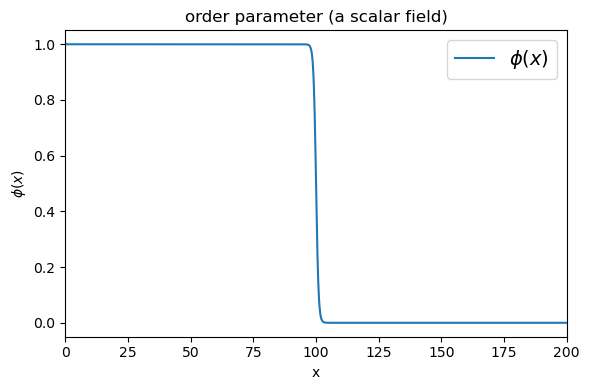
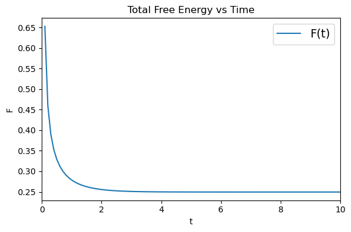
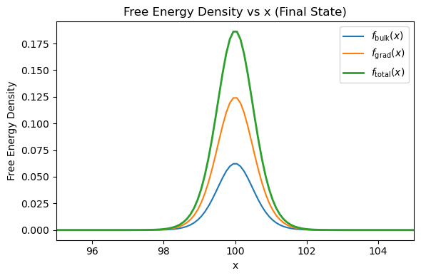
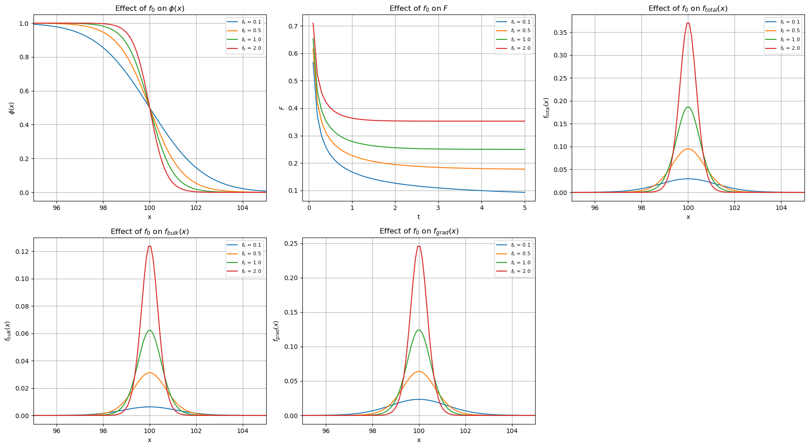
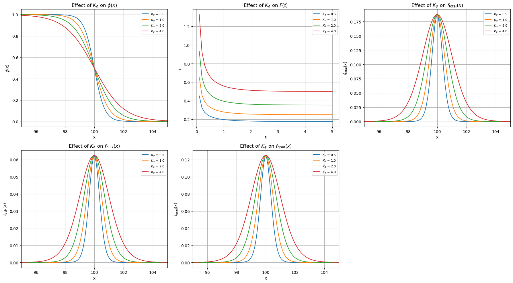
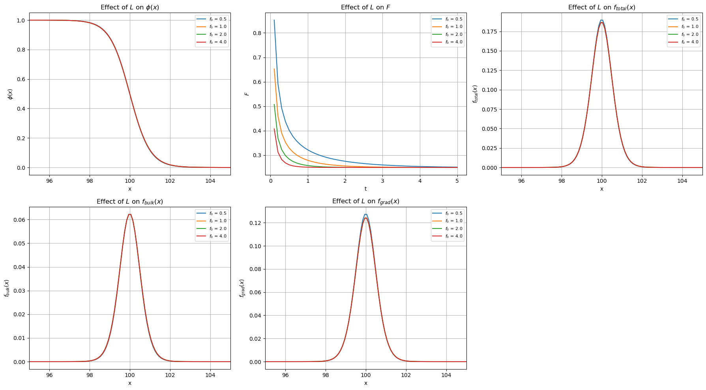
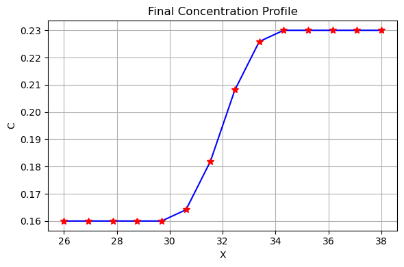
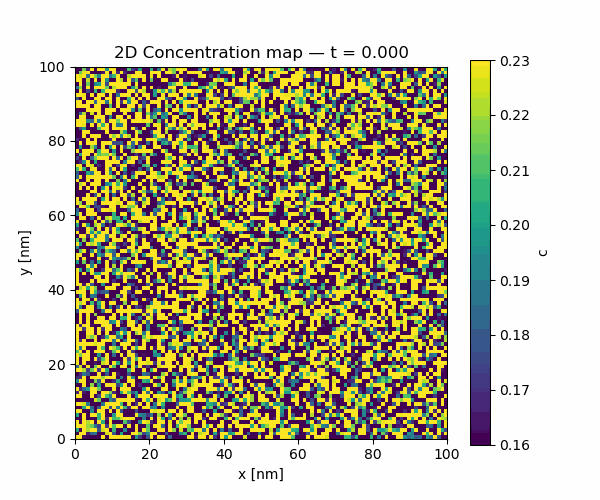

# Phase-Field Simulation — Allen-Cahn & Cahn-Hilliard (FiPy)

**Course:** Materials Simulation Practical | FAU Erlangen-Nürnberg  
**Tools:** Python · FiPy · NumPy · Matplotlib

📓 [Written report](report.ipynb) | 💻 [Simulation code](phase_field_simulation.ipynb)

---

## Overview

Numerical implementation of the phase-field method using the finite volume approach in FiPy. The project covers two coupled formulations: (1) the Allen-Cahn equation for non-conserved order parameter evolution, applied to 1D solidification with systematic parameter studies; and (2) the Cahn-Hilliard equation for conserved concentration dynamics, applied to spinodal decomposition in the Ni-Al binary alloy system in both 1D and 2D.

---

## Part 1 — Allen-Cahn: Solidification (1D)

The Allen-Cahn equation governs the time evolution of a non-conserved order parameter φ ∈ [0,1], where φ = 1 represents the solid phase and φ = 0 the liquid. The system is initialized with a sharp step interface at x = 100 on a domain of length 200, using a double-well bulk free energy f(φ) = f₀ φ²(1−φ)².

### Steady-State Interface Profile



The diffuse interface profile at steady state shows the characteristic hyperbolic tangent shape. The interface width is controlled by the competition between the gradient penalty K_φ and the bulk energy barrier f₀.

### Free Energy Decay



The total free energy F(t) decays monotonically to its equilibrium value, confirming thermodynamic consistency. The rapid initial drop corresponds to the sharp-interface relaxation; the slow tail reflects diffuse interface equilibration.

### Free Energy Density at the Interface



In the final state, the free energy density is localized entirely at the interface. The gradient contribution f_grad dominates over the bulk contribution f_bulk, consistent with a well-resolved diffuse interface where the bulk phases are fully relaxed.

---

## Parameter Studies

The effect of three model parameters on the interface profile and energy landscape was systematically investigated by varying one parameter at a time while holding the others fixed.

### Effect of f₀ (bulk energy barrier height)



Higher f₀ sharpens the interface and raises the total stored energy. Both bulk and gradient energy contributions scale with f₀, while the interface position remains fixed — confirming that f₀ controls the thermodynamic driving force without affecting interface location.

### Effect of K_φ (gradient energy coefficient)



Increasing K_φ widens the interface and increases the gradient energy cost. The bulk energy density profile is largely unaffected, confirming that K_φ independently controls interface thickness. The total free energy grows with K_φ due to the broader interfacial region.

### Effect of L (interface mobility)



L controls kinetics only — all curves converge to the same final φ(x) profile regardless of L value, while higher L accelerates the approach to equilibrium. This is visible in the F(t) plot where steeper decay corresponds to larger L, with identical plateau values.

---

## Part 2 — Cahn-Hilliard: Spinodal Decomposition in Ni-Al (1D & 2D)

The Cahn-Hilliard equation governs conserved concentration dynamics via:
```
∂c/∂t = ∇ · (M ∇μ),    μ = df/dc − K_c ∇²c
```

Physical parameters for the Ni-Al system:

| Parameter | Value |
|-----------|-------|
| c_γ (Al-poor equilibrium) | 0.16 |
| c_γ' (Al-rich equilibrium) | 0.23 |
| Gradient coefficient K_c (1D) | 3.9×10⁻⁶ J/m |
| Gradient coefficient K_c (2D) | 2.45×10⁻⁷ J/m |
| Mobility M | 10⁻¹⁷ · Vm² m⁵/(J·s) |
| Bulk energy scale f₀ | 9.989×10⁷ J/m³ |

### 1D Concentration Profile



The final concentration profile shows sharp segregation between the γ (Al-poor, c = 0.16) and γ' (Al-rich, c = 0.23) phases, with a well-resolved diffuse interface. Computed interfacial energies at steady state:

| Contribution | Value |
|---|---|
| F_bulk | 0.2367 J/m² |
| F_grad | 0.2368 J/m² |
| F_total | 0.4735 J/m² |

The near-equal bulk and gradient contributions confirm the interface is at its natural width set by the K_c / f₀ balance.

### 2D Spinodal Decomposition (Animated)

Starting from a Gaussian noise initial condition centered at c₀ = 0.195 on a 100×100 nm² domain, the 2D simulation captures the full spinodal decomposition process from a disordered solid solution into phase-separated γ and γ' domains. Over time, diffuse Al-poor and Al-rich domains nucleate and coarsen, driven purely by free energy minimization. The full time evolution is shown in the animation below.



---

## Requirements
```bash
pip install fipy numpy matplotlib scipy
```

---

## Usage

Open `phase_field_simulation.ipynb` in Jupyter and run cells sequentially. The 2D Cahn-Hilliard simulation runs 1000 steps on a 100×100 nm² mesh and saves the animation as `ch_2d.gif`. Expect 10–20 minutes on a standard laptop.
